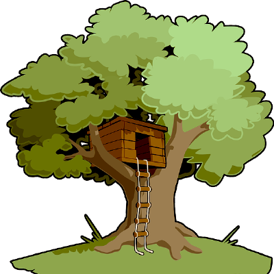

# Add a TreeSitter grammar

In the HyperAST you can add a TreeSitter grammar to handle more programming languages.

    

> [Getting Started TreeSitter](https://tree-sitter.github.io/tree-sitter/creating-parsers)

> [How to Write a Tree-Sitter Grammar](https://gist.github.com/Aerijo/df27228d70c633e088b0591b8857eeef)