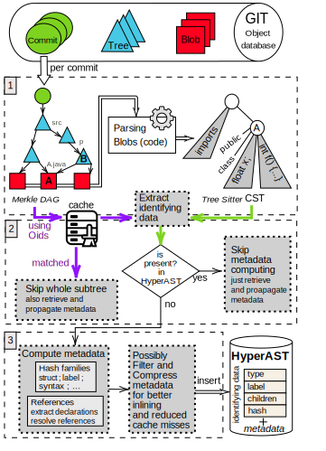
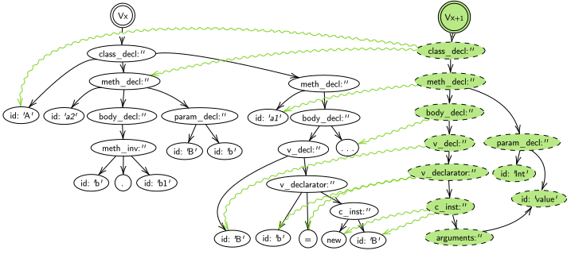
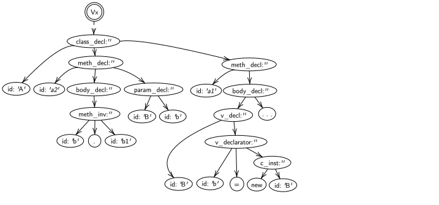

# Scientific Literature

> [HyperAST Paper](https://doi.org/10.1145/3551349.3560423)

---

<!-- 
 -->
Structure of the HyperAST explained in the paper

<!--   -->
<!-- 
 -->

---
Example detailed in the Paper

         
    

